# Learning-Based Temporal Motion Prediction for Risk-Aware Autonomous Driving

**RGB Camera Sequences → Temporal Deep Learning → Future Motion Prediction → Risk-Aware Visualization**

This project investigates learning-based future motion prediction for autonomous driving using sequential RGB camera observations. It compares two temporal architectures—**CNN → LSTM** and **CNN → BiLSTM**—and connects predicted trajectories to a simple risk-aware analysis.

---

## 🚀 Overview

- **Input:** Sequential RGB camera frames (Argoverse 2 Sensor Dataset)  
- **Pipeline:** Detection → Tracking → Trajectory History → ResNet-18 Features → LSTM/BiLSTM → Future Trajectories  
- **Output:** Predicted trajectories, ADE/FDE metrics, risk levels, and visualizations  

The core idea: *single-frame perception tells what is happening now; temporal prediction tells what is likely to happen next.*

---

## 🎯 Objectives

- Process sequential RGB observations and track objects over time  
- Build trajectory histories and extract visual features with ResNet-18  
- Model temporal dynamics using **LSTM** and **BiLSTM**  
- Predict multiple future trajectory points  
- Evaluate with **ADE** (Average Displacement Error) and **FDE** (Final Displacement Error)  
- Compare LSTM vs BiLSTM performance  
- Link future motion to a simple **risk assessment** (distance, speed, TTC)  
- Provide interpretable quantitative and visual results  

---

## 🧠 Models

| Model   | Temporal Processing                 |
|--------|-------------------------------------|
| LSTM   | Unidirectional recurrent modeling   |
| BiLSTM | Bidirectional recurrent modeling    |

Both models predict the same future trajectory points and are compared using the same metrics and visualizations.

### Model Performance

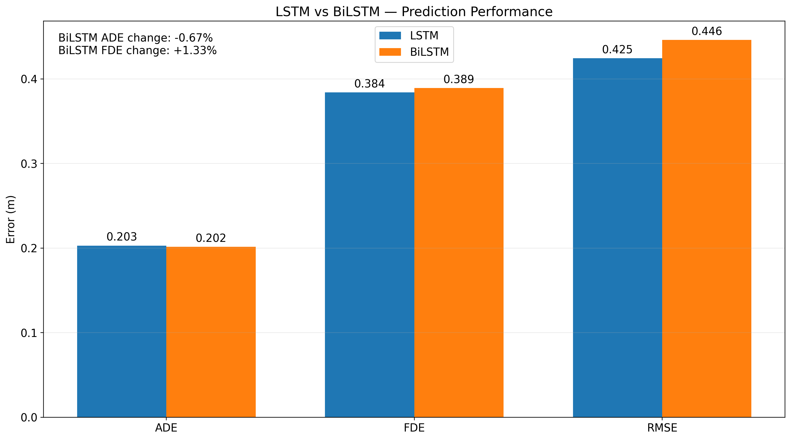

---

## 📊 Evaluation

The models are evaluated using trajectory prediction errors and additional analyses.

### ADE and FDE

- **ADE:** Average displacement error across the prediction horizon.  
- **FDE:** Final displacement error at the final prediction timestep.  
- **Lower values indicate better trajectory prediction accuracy.**

### Prediction Horizon

Prediction error is analyzed across different future timesteps.

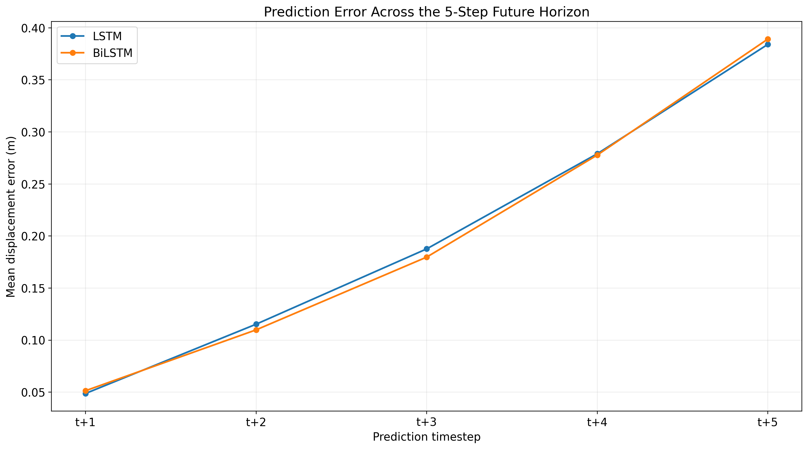

### Class-wise Performance

Prediction accuracy is also analyzed across object classes.

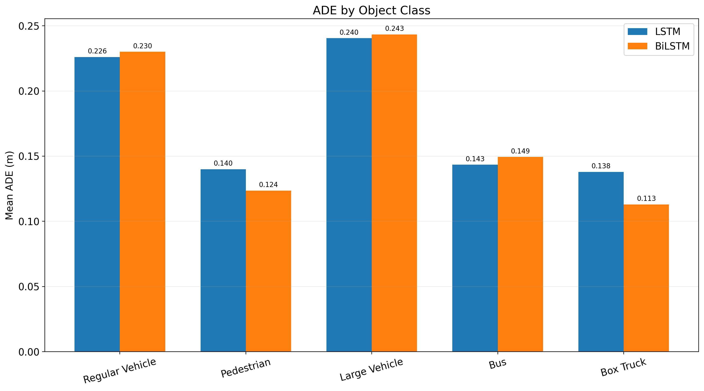

### ADE Distribution

The distribution of trajectory prediction errors is shown below.

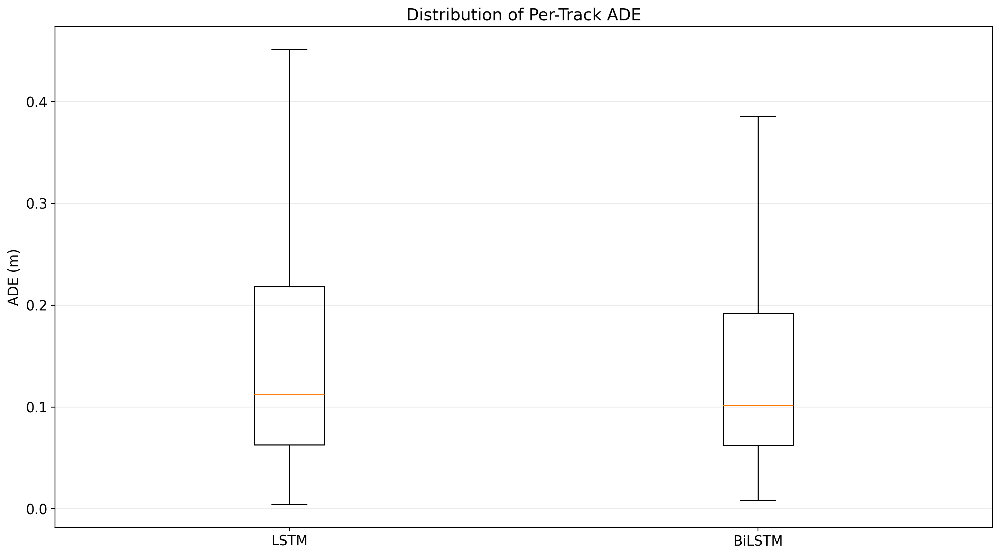

### Risk Distribution

The generated risk levels are summarized below.

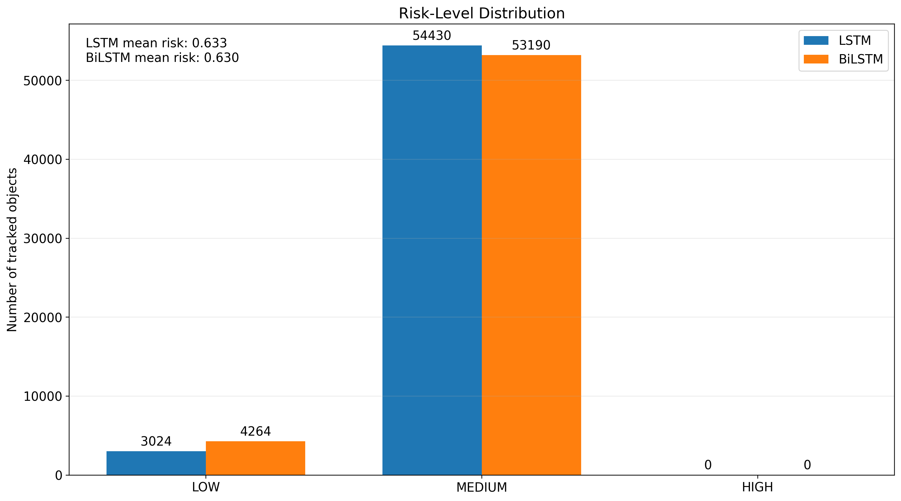

---

## 🎯 Trajectory Visualization

The system compares the observed trajectory, predicted future trajectory, and ground-truth future trajectory.

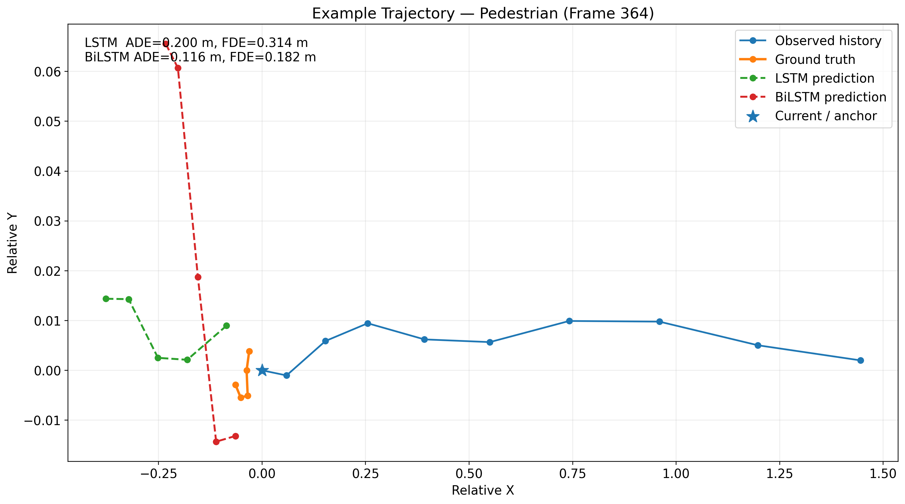

The visualization provides a qualitative complement to ADE/FDE by showing how the predicted trajectory behaves relative to the actual future motion.

### LSTM vs BiLSTM Summary

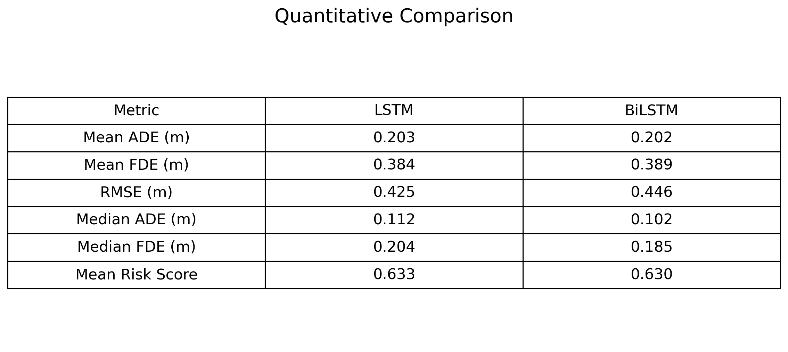

---

## 🎥 Demo Visualization

The final visualization combines the camera scene, tracked objects, trajectory prediction, ground truth, prediction errors, and risk information.

### LSTM

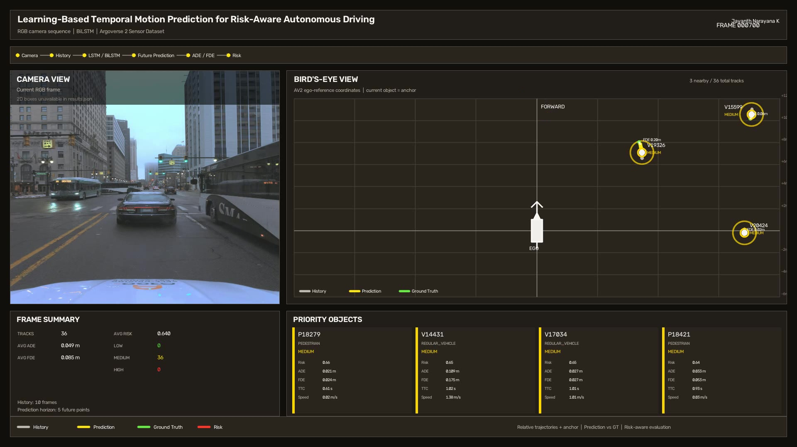

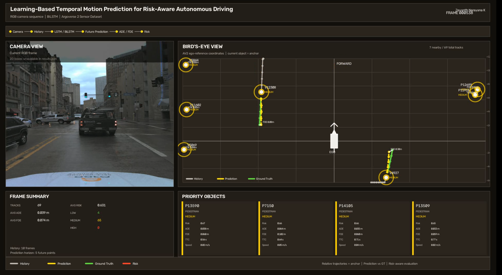

### BiLSTM

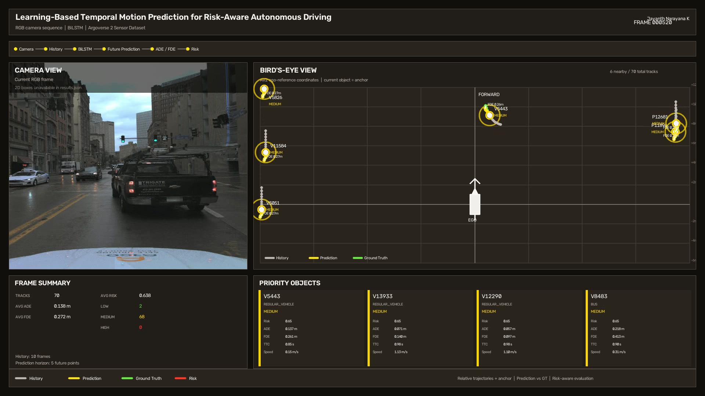

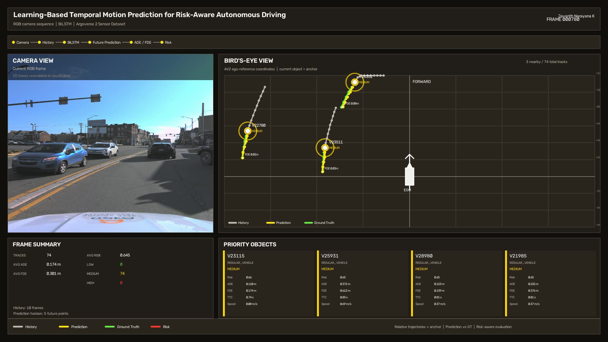

---

## 🗂️ Repository Structure

```text
temporal-risk-prediction/
│
├── src/
│   ├── config.py
│   ├── dataset_builder.py
│   ├── detect.py
│   ├── track.py
│   ├── tracked_object.py
│   ├── trajectory.py
│   ├── train.py
│   ├── predict.py
│   ├── evaluate.py
│   ├── risk.py
│   ├── results_analyzer.py
│   ├── results_analyzer_bilstm.py
│   └── main.py
│
├── models/
│   ├── lstm/
│   └── bilstm/
│
├── outputs/
│   └── figures/
│       ├── 01_lstm_vs_bilstm_performance.png
│       ├── 02_error_vs_prediction_horizon.png
│       ├── 03_classwise_ADE.png
│       ├── 04_risk_distribution.png
│       ├── 05_example_trajectory_comparison.png
│       ├── 06_ADE_distribution.png
│       ├── 07_comparison_table.png
│       ├── lstm_demo_01.jpg
│       ├── lstm_demo_02.png
│       ├── bilstm_demo_01.jpg
│       ├── bilstm_demo_02.jpg
│       └── groupC.pdf
│
├── notebooks/
├── configs/
├── docs/
├── tests/
│
├── README.md
├── requirements.txt
└── .gitignore
```

---

## ⚙️ Installation

```bash
git clone https://github.com/Jayanth3105/temporal-risk-prediction.git
cd temporal-risk-prediction

python3 -m venv venv
source venv/bin/activate  # or `venv\Scripts\activate` on Windows

pip install -r requirements.txt
```

> The Argoverse 2 dataset must be downloaded and prepared separately.

---

## ▶️ Usage

Run the main pipeline:

```bash
python3 src/main.py
```

Configuration is controlled via `src/config.py`. Individual stages (dataset building, training, prediction, evaluation, risk analysis) are implemented as separate modules under `src/`.

---

## 📈 Outputs

The project produces:

- Trained models (LSTM / BiLSTM)  
- Trajectory predictions (JSON / internal formats)  
- Evaluation metrics (ADE, FDE, horizon-wise errors)  
- Risk analysis results  
- Plots and figures in `outputs/figures/`  
- Demo videos (distributed separately due to size):  
  - `result_lstm.mp4`  
  - `result_bilstm.mp4`  

---

## 🧪 Results

- **Quantitative:**  
  - LSTM vs BiLSTM ADE/FDE  
  - Error vs prediction horizon  
  - Class-wise ADE  
  - ADE and risk distributions  
- **Qualitative:**  
  - Observed vs predicted vs ground-truth trajectories  
  - Camera scenes with tracked objects and risk levels  

Numerical metrics are interpreted together with trajectory visualizations and risk analysis.

---

## ⚠️ Limitations

- Experimental research implementation, not a production ADAS system  
- Future motion is inherently uncertain; errors grow with prediction horizon  
- Camera-based perception depends on scene and visibility conditions  
- Risk assessment is a simplified, research-oriented formulation  

---

## 🔮 Future Work

Possible extensions:

- Improved coordinate-frame handling  
- Longer prediction horizons  
- Additional temporal architectures (e.g., Transformers, attention)  
- Uncertainty-aware and multimodal trajectory prediction  
- More sophisticated risk modeling  
- Larger-scale evaluation and integration with planning/control  

---

## 📄 License & Citation

*(Add your license and citation info here if needed.)*

---

## 👤 Author

**Jayanth Narayana K**  
Kyushu Institute of Technology  

Project: *Learning-Based Temporal Motion Prediction for Risk-Aware Autonomous Driving*
